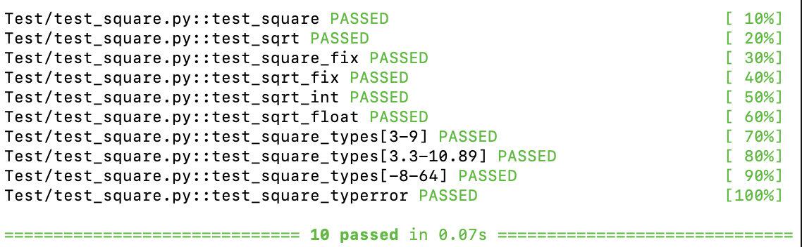
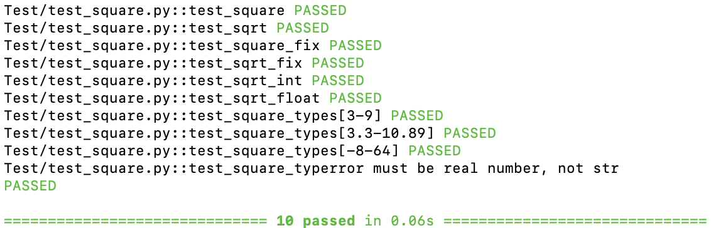

# 

To run this code, follow the steps below:
<ol>
<li>Install pytest module

pip install pytest

<li> Run pytest from the root directory i.e, PyTest in this case

Pytest will find the tests and run them

python -m pytest

To make the test result verbose, add -v flag

To see the print statements displayed in the test result, add the -s flag

</ol>

<h3>Types of pytest decorators explained</h3>
<ul>
<li><b>pytest.fixture</b> - A function in Pytest that allows same code to be used in multiple tests.
When fixture function is attached to a test function, it will return the data to the test before execution.

<li><b>pytest.mark.parametrize</b> - allows parameterization of arguments to a test function. Using this multiple inputs can be test using the same test function without duplicating the code.

<li><b>pytest.raises</b> - checks if the correct Exception is raised when an incorrect/incompatible input is provided in the test

<li><b>pytest.mark.skip<b> - skips the test case 

<li><b>pytest.mark.skipif<b> - skips the test case based on the value of the condition provided

</ul>

